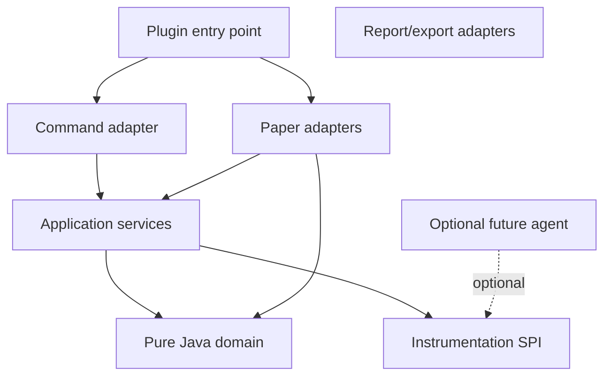

# AGENTS.md

## Project purpose

EventLens is a Paper server-side diagnostics plugin intended to explain how events travel through registered plugin listeners.

The product helps server administrators and plugin developers answer questions such as:

- Which plugins listen to this event?
- In what priority and order are listeners invoked?
- Which listener changed cancellation state?
- Which supported event properties changed?
- Which listener appears slow?
- Was a trace incomplete because of sampling, limits, unsupported data, or an error?

EventLens must observe server behavior without changing it.

Planned capabilities are not implemented until source and tests prove they exist.

## Current project facts

| Property | Value |
|---|---|
| Project | EventLens |
| Platform | Paper 26.2 |
| Language | Java 25 |
| Build system | Gradle Wrapper 9.6.1 |
| Build DSL | Groovy Gradle |
| Development server | run-paper 3.0.2 |
| Operating system baseline | Windows |
| Base package | `dev.bellaouzo.eventlens` |
| Main class | `dev.bellaouzo.eventlens.EventLens` (in `eventlens-paper`) |
| Plugin metadata file | `eventlens-paper/src/main/resources/plugin.yml` |
| Paper plugin JAR | `eventlens-paper/build/libs/EventLens-*.jar` |
| Current version | `1.0.0` |
| Gradle group | `dev.bellaouzo` |
| Paper API dependency | `26.2.build.92-stable` (pinned in `gradle.properties`) |
| Current commands | `/eventlens status`, `listeners`, `trace` (alias `el`) |
| Current permissions | `eventlens.command.status`, `.listeners`, `.trace` (default op) |
| Gradle subprojects | `eventlens-core`, `eventlens-paper`, `eventlens-mod-common`, `eventlens-neoforge`, `eventlens-forge`, `eventlens-fabric`, `eventlens-observability`, `eventlens-agent`, `eventlens-client-agent`, `eventlens-testkit` |
| Client mods (optional) | NeoForge/Forge/Fabric — `/eventlens` status/listeners/trace with clickable chat; 33 client events |
| Test framework | JUnit 5 |
| Current tests | Session/trace, timing analyzers, budget controller, sampling, command permissions (MockBukkit), Paper/client agent load (forked JVM), ArchUnit |
| CI workflows | `.github/workflows/ci.yml` (`check` + `paperSmokeTest` on push/PR) |
| ArchUnit / JaCoCo / Spotless | Configured |
| MockBukkit | Configured (`mockbukkit-v26.1.2`) |
| License | MIT |

Update this table when repository facts change. Do not guess missing values.

## Initial supported trace events

Tracing and snapshot capture are limited to these event types until expanded explicitly in `SupportedEventTypes`:

- `BlockBreakEvent`, `BlockPlaceEvent`
- `PlayerInteractEvent`, `PlayerMoveEvent`, `PlayerTeleportEvent`, `PlayerCommandPreprocessEvent`
- `InventoryClickEvent`
- `EntityDamageEvent`, `EntityDeathEvent`
- `AsyncChatEvent`

`listeners` still resolves any registered Bukkit event; `trace start` rejects events outside this list.

## Current implementation status

**Implemented and verified**

- Plugin loads on Paper 26.2 (Java 25)
- `/eventlens status`, `listeners`, `trace` commands
- Listener inventory, trace sessions, snapshots/diffs, timing metrics
- Optional Java agent for per-listener timing (`eventlens-agent`; dev `runServer` attaches automatically)
- Performance budget controller, hot-event sampling, timing output in `trace view`
- Gradle `runServer` and `runServerDebug` with `-javaagent`
- Optional NeoForge and Minecraft Forge 1.21.1 client mods (`:eventlens-neoforge:runClient`, `:eventlens-forge:runClient`) plus Fabric chat commands; 33 client events
- Client session pause/resume (`/eventlens trace pause|resume`) and Screen hover details on live/idle and precise/dispatch
- NeoForge client lists `@SubscribeEvent` subscribers and flags multi-mod overlap
- Optional client Java agent (`eventlens-client-agent`) times NeoForge and Forge game-bus handlers; both `runClient` tasks attach it
- NeoForge/Forge in-game Screen and optional HUD (`/eventlens ui`); chat remains a fallback

**Not implemented**

- Export timing aggregates and structured reports (Milestone 6)
- Fabric client Java agent (deferred; see `docs/adr/0003-client-java-agent.md`)
- Fabric in-game Screen/HUD (deferred; see `docs/CLIENT_UI.md`)

## Source-of-truth order

1. Explicit current user request
2. Compiling source and automated tests
3. Build files and plugin metadata
4. `.cursor/rules/*.mdc`
5. This `AGENTS.md`
6. Architecture decision records
7. Other project documentation

## Required commands

Run all normal Gradle work through the committed Wrapper.

### Windows

```powershell
.\gradlew.bat --version
.\gradlew.bat clean build
.\gradlew.bat test
.\gradlew.bat check
.\gradlew.bat runServer
.\gradlew.bat runServerDebug
.\gradlew.bat --stop
```

If `java -version` shows Java 8 in a Cursor terminal, restart Cursor or run:

```powershell
$env:JAVA_HOME = [Environment]::GetEnvironmentVariable('JAVA_HOME','User')
$env:Path = "$env:JAVA_HOME\bin;" + $env:Path
.\gradlew.bat --stop
```

### Expected output

Plugin JAR: `eventlens-paper/build/libs/EventLens-1.0.0.jar`

Local Paper server directory: `run/` (gitignored)

## Normal development workflow

1. Read this file and applicable `.cursor/rules` files.
2. Inspect git status and relevant source files.
3. Make the smallest coherent change.
4. Add or update tests.
5. Run focused tests, then `.\gradlew.bat check`.
6. Run the Paper test server when platform behavior changed.
7. Inspect `run\logs\latest.log`.
8. Stop the server with `stop` (never `/reload`).
9. Update documentation when behavior changes.

## Debug workflow

Debug port: `127.0.0.1:5005` (localhost only)

1. Run task **EventLens: Run Paper Server (Debug)** or `.\gradlew.bat runServerDebug`
2. Launch **Java: Attach to EventLens Paper Server**
3. Set breakpoints, reproduce behavior, stop server gracefully

## Product invariants

EventLens must not change observed events, reorder listeners, invoke listeners twice, hide exceptions, retain live Bukkit objects, collect unbounded data, or enable network telemetry by default.

## Architecture overview



Dependency arrows point inward. Domain code must not import Paper.

## Performance and resource limits

| Limit | Default |
|---|---:|
| Concurrent sessions | 4 |
| Records per session | 4,096 |
| Listener records per dispatch | 256 |
| Snapshot fields | 64 |
| Snapshot depth | 2 |
| Collection/map entries | 32 |
| Captured string | 512 chars |
| Serialized record | 16 KiB |
| Export file | 32 MiB |
| Pending exports | 2 |

Performance targets per observed dispatch: avg <= 0.25 ms, p95 <= 0.75 ms, throttle above 1 ms p95, stop above 2.5 ms p95 for three windows, emergency stop above 10 ms single operation.

These are EventLens design defaults, not Paper guarantees.

## Privacy summary

No external telemetry by default. Shareable exports redact player names, world names, exact coordinates, and paths unless explicitly enabled.

See `docs/PRIVACY.md`.

## Testing matrix

| Layer | Tool | Status |
|---|---|---|
| Pure domain / application | JUnit 5 | Partial (`TraceSessionManagerTest`, `StatusQueryServiceTest`) |
| Architecture | ArchUnit | Configured (`ArchitectureTest`) |
| Lightweight plugin | MockBukkit | Basic command/permission coverage |
| Real platform | run-paper | Manual via `runServer` |
| Fixture plugin | EventLensTestTarget | TODO |
| Agent | Forked JVM | TODO |

## CI pipeline

Configured: `.github/workflows/ci.yml` runs Java 25 setup, Gradle wrapper validation, `./gradlew check`, and Windows `.\gradlew.bat paperSmokeTest` on push/PR to `main` or `master`.

Planned additions: JAR inspection.

## Versioning

Semantic Versioning (`MAJOR.MINOR.PATCH`). Current release is `1.0.0`.

Agents bump the version and update `CHANGELOG.md` on user-visible work without waiting to be asked. See `.cursor/rules/versioning.mdc`.

## Definition of done

A change is complete when relevant tests pass, `.\gradlew.bat check` passes, Paper integration is tested when needed, logs are inspected, documentation matches behavior, and limitations are stated.

## Current milestones

### Repository foundation — **partial**

Cursor rules, AGENTS.md, docs skeleton, Gradle wrapper, JUnit foundation, ArchUnit, JaCoCo, CI, CHANGELOG, and local Paper server verified.

### Listener inventory — **not started**

### Bounded trace sessions — **not started** (session manager stub only)

### Snapshots and diffs — **not started**

### Advanced interception / agent — **not started**

## Next recommended tasks

1. Implement listener inventory MVP for one event type on real Paper.
2. Expand MockBukkit coverage to lifecycle and command registration edge cases.
3. Add artifact inspection/release checks in CI.
