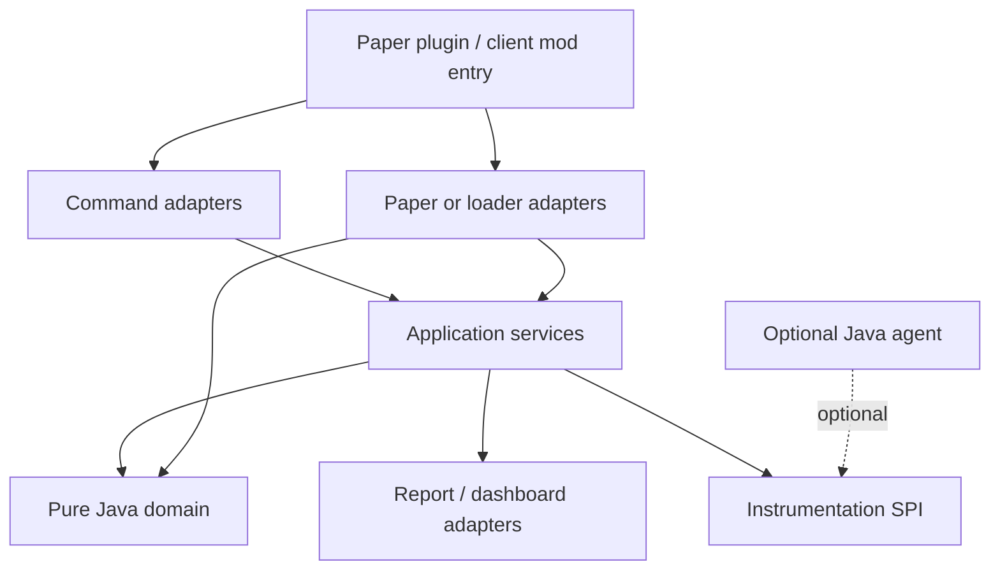

# EventLens

**See how Minecraft events travel through plugins and mods — without changing them.**

[](CHANGELOG.md)
[](#quick-start)
[](#development)
[-green)](#client-mods)
[](LICENSE)

EventLens is a **preview/beta** diagnostics plugin for **Paper 26.2**, with optional **NeoForge**, **Forge**, and **Fabric** **26.2** client mods. It answers the questions chat logs and spark usually cannot: who listened, in what order, who cancelled or threw, which handler was slow, and what a single click actually did.

It observes. It does not cancel, reorder, re-fire, or hide exceptions.

| Paper plugin | Client mods | License |
|---|---|---|
| Paper **26.2** · Java **25** · `/eventlens` (`/el`) | Minecraft **26.2** · NeoForge / Forge / Fabric client mods | [MIT](LICENSE) |

**[Features](#features)** · **[Quick start](#quick-start)** · **[Java agents](#java-agents-optional)** · **[Commands](#commands)** · **[Client mods](#client-mods)** · **[Dashboard](#dashboard)** · **[Configuration](#configuration)** · **[Development](#development)**

---

## Features

- **Listener inventory** — any registered Bukkit event, with priority and order
- **Trace sessions** — snapshots, diffs, cancellation, exceptions, and timing
- **Optional Java agents** — per-listener timing on Paper; per-mod timing on NeoForge and Forge
- **Live dashboard** — graphs, timeline, and compare at `http://127.0.0.1:8765`
- **Shareable bundles** — export a self-contained `index.html` report
- **Client mods** — the other half of a click, plus an in-game Screen and HUD

| Piece | Who it is for | Required? |
|---|---|---|
| **Paper plugin** `EventLens-1.10.7-beta.jar` | Server operators and plugin authors | Yes, for server traces |
| **Paper Java agent** `eventlens-agent-1.10.7-beta.jar` | Per-listener timing and exception attribution | Optional |
| **NeoForge client mod** (26.2) | Client-side traces, Screen, HUD | Optional; preview |
| **Forge client mod** (26.2) | Client-side traces, Screen, HUD | Optional; preview |
| **Fabric client mod** (26.2) | Client-side traces, Screen, HUD | Optional; preview |
| **Client Java agent** `eventlens-client-agent-1.10.7-beta.jar` | Per-mod handler timing on NeoForge, Forge, and Fabric | Optional |
| **Dashboard** at `http://127.0.0.1:8765` | Live graphs, timeline, compare | Ships with the Paper plugin |
| **Bundle export** | Share a self-contained `index.html` report | Paper command |

The plugin is useful without any agent or client mod. Agents add precise timings. Client mods add what the client fired before the server saw it.

> **No Java agent?** EventLens still works. Run `/eventlens status` — if you see `dispatch-only` and want precise timing, see **[Java agents](#java-agents-optional)** for launcher step-by-step setup (Prism, CurseForge, Modrinth).

---

## Quick start

1. Run **Java 25**. Drop `eventlens-paper/build/libs/EventLens-1.10.7-beta.jar` into `plugins/`.
2. Restart the server (`stop`, then start — do not `/reload`). Commands default to **op**.
3. Trace a click, then open the dashboard or an exported bundle.

```
/eventlens status
/eventlens listeners PlayerInteractEvent --detail verbose
/eventlens trace start PlayerInteractEvent,BlockBreakEvent --preset block-flow
# reproduce the bug
/eventlens trace view <sessionId>
/eventlens trace export <sessionId> --format bundle
/eventlens trace stop
```

Then open the exported folder’s `index.html`, or the live dashboard at [http://127.0.0.1:8765](http://127.0.0.1:8765) on the server machine.

Built artifact after `.\gradlew.bat build`:

```
eventlens-paper/build/libs/EventLens-1.10.7-beta.jar
```

---

## Java agents (optional)

**You do not need an agent to use EventLens.** Everything else in this README works without one.

An agent only adds **extra timing detail** (which exact listener or mod handler was slow). If `/eventlens status` already says **precise**, you are done — skip this section.

If it says **dispatch-only**, you can keep using EventLens as-is, or follow the steps below to enable precise timing.

### What goes where (client)

| File | Put it here | Wrong place |
|---|---|---|
| `eventlens-neoforge-*.jar` (or Forge / Fabric mod) | Your instance **`mods`** folder | — |
| `eventlens-client-agent-*.jar` | A normal folder on disk + tell the **launcher** about it (below) | **`mods`** (launcher says “not a valid mod file”) |
| `eventlens-observability-*.jar` | **Same folder** as the client agent jar | **`mods`** |

Download all files from [GitHub Releases](https://github.com/bellaouzo/EventLensMC/releases). Use the **same version** as your EventLens mod (for example `1.10.7-beta`).

### Client agent (NeoForge and Forge) — step by step

This is for **your Minecraft launcher**, not the server. Use the same client agent jar on NeoForge, Forge, and Fabric.

**Step 1 — Download the client agent**

From the release page, download `eventlens-client-agent-1.10.7-beta.jar`.

`eventlens-observability-*.jar` in the same folder is optional on **1.10.7-beta+** (the agent jar is fat). Older builds still want both jars side by side.

**Step 2 — Put the agent jar in a normal folder**

Example on Windows:

```
C:\Users\You\AppData\Roaming\eventlens-agents\eventlens-client-agent-1.10.7-beta.jar
```

Do **not** put this file in `mods/`.

**Step 3 — Copy the “JVM argument” line**

Replace the path with **your** real path. Use forward slashes `/` even on Windows:

```
-javaagent:C:/Users/You/AppData/Roaming/eventlens-agents/eventlens-client-agent-1.10.7-beta.jar
```

Rules:

- One line, no line breaks.
- Starts with `-javaagent:` then the **full path** to the jar.
- If the path has spaces, wrap only the path in quotes:
  `-javaagent:"C:/Users/You/My Agents/eventlens-client-agent-1.10.7-beta.jar"`
- Do **not** use a relative path like `-javaagent:eventlens-client-agent.jar` unless you are sure the launcher’s working directory is that folder.

**Step 4 — Paste into JVM arguments (not game arguments)**

Look for a box labeled **JVM arguments**, **Java arguments**, **Additional arguments**, or **Custom JVM args** — **not** “game arguments” and **not** the mods folder.

<details>
<summary><strong>Prism Launcher / MultiMC</strong> (common for modded)</summary>

1. Select your NeoForge or Forge instance.
2. Click **Edit** (wrench icon) → **Settings** → **Java** (or **Java/Minecraft**).
3. Check **Custom Java arguments** (wording may vary).
4. In **JVM arguments**, paste the `-javaagent:...` line from Step 3.
   If there is already text in the box, add a **space**, then paste on the end.
5. Click **OK**, then **Launch**.

</details>

<details>
<summary><strong>CurseForge app</strong></summary>

1. Open **My Modpacks** / **Minecraft** and find your profile.
2. Click the **⋮** menu on the profile → **Profile options** (or **Modify**).
3. Open **Java Settings** / **Advanced** / **Additional Arguments**.
4. Paste the `-javaagent:...` line into **JVM arguments** or **Additional parameters**.
5. Save and **Play**.

If your CurseForge version has no JVM box, use [Prism Launcher](https://prismlauncher.org/) to import the same instance — it exposes Java args reliably.

</details>

<details>
<summary><strong>Modrinth App</strong></summary>

1. Select the instance → **Settings** (gear).
2. Find **Java** or **Advanced** → **Custom JVM arguments**.
3. Paste the `-javaagent:...` line, save, and launch.

</details>

<details>
<summary><strong>Other launchers or a `.bat` file</strong></summary>

Any launcher that lets you edit **JVM arguments** for the instance works the same way: paste the `-javaagent:` line there.

If you start Minecraft from a script, add the line to the `java` command **before** `-jar` or the main class, for example:

```
java -javaagent:C:/path/to/eventlens-client-agent-1.10.7-beta.jar ... (rest of launch command)
```

The official **Microsoft Minecraft Launcher** (vanilla) does not expose JVM args for modded profiles. Use Prism, CurseForge, or Modrinth for modded + agent setup.

</details>

**Step 5 — Restart the game completely**

Close Minecraft and open it again from the launcher (not just “Leave world”).

**Step 6 — Check in chat**

```
/eventlens status
```

You want **Instr. precise** (green), not **dispatch-only** (yellow). In-game status also has **[Copy JVM arg]** if you need the line again.

<details>
<summary><strong>Instant crash after adding the JVM arg?</strong></summary>

The game window never opening usually means Java rejected the argument **before** Minecraft starts — not an EventLens mod bug.

Check these in order:

1. **Wrong field** — The line must go in **JVM / Java arguments**, not “Game arguments”, not “Environment variables”, not the mods folder.
2. **Bad path** — Java cannot find the jar. Open the path in File Explorer and confirm the file exists. Use a **full** path with forward slashes, e.g. `C:/Users/You/.../eventlens-client-agent-1.10.7-beta.jar`.
3. **Typo in the line** — Must be `-javaagent:` (colon), not `-javaagent=` or `-java-agent:`. No extra quotes around the whole line unless your path has spaces (quote only the path).
4. **Wrong jar** — Use `eventlens-client-agent-*.jar` for the **client**, not `eventlens-agent-*.jar` (that one is for Paper servers).
5. **Smart quotes** — Re-type the line manually if you copied from a web page and it still fails.
6. **Read the launcher log** — Prism: instance → **Launch** fails → open **Log** tab. Look for `Error opening zip file`, `Unable to access jarfile`, or `agent failed`.

If the game **does** start but `/eventlens status` stays `dispatch-only`, the agent line loaded but precise timing failed — check the log for `[EventLens] Client agent failed to start`.

**Workaround:** Remove the JVM line entirely. EventLens still works in `dispatch-only` mode with only the mod in `mods/`.

Once the game **does** start, run `/eventlens status` — EventLens reads your launcher’s JVM arguments and will call out a **missing jar path**, a **relative path**, or the **wrong agent jar** when it can.

</details>

---

### Paper server agent (optional)

For **server** operators who want per-listener timing on Paper (not the Minecraft client).

1. Download `eventlens-agent-1.10.7-beta.jar` from [releases](https://github.com/bellaouzo/EventLensMC/releases).
2. Put it somewhere stable (for example next to your server jar).
3. Add this to **Paper’s startup JVM arguments** (however you normally start the server — `start.bat`, Pterodactyl, Docker, etc.):

```
-javaagent:/full/path/to/eventlens-agent-1.10.7-beta.jar
```

Use the real path on your machine. On Windows you can use `C:/server/eventlens-agent-1.10.7-beta.jar` style paths.

4. **Restart the server** (`stop`, then start — do not `/reload`).
5. Run `/eventlens status` → **Agent: attached**, **Mode: precise**.

Development `runServer` attaches the Paper agent automatically.

<details>
<summary><strong>Why agents are separate from the mod / plugin</strong></summary>

Agents must load at **Java startup**, before Minecraft or Paper fully starts. That is why they use `-javaagent:` in launcher or server startup — not the `mods` or `plugins` folder. They are optional; EventLens still traces events without them, just with less per-handler timing detail.

</details>

---

## Client mods (optional)

Install **one** loader jar that matches your client:

| Loader | Minecraft | Artifact |
|---|---|---|
| **NeoForge** 26.2.x | 26.2 | `eventlens-neoforge/build/libs/eventlens-neoforge-1.10.7-beta.jar` |
| **Minecraft Forge** 65.1+ | 26.2 | `eventlens-forge/build/libs/eventlens-forge-1.10.7-beta.jar` |
| **Fabric** Loader 0.19 + Fabric API 0.157+ | 26.2 | `eventlens-fabric/build/libs/eventlens-fabric-1.10.7-beta.jar` |

Put the jar in the client `mods/` folder. Chat commands work on all three. Screen, HUD, and keybinds work on all three. For **precise per-mod timing** on NeoForge or Forge, you also need the [client Java agent](#client-agent-neoforge-and-forge--step-by-step) (launcher JVM args — not another mod in `mods/`).

---

## Commands

Alias: `/el`. All commands default to **op**.

| Command | What it does | Permission |
|---|---|---|
| `/eventlens` or `/eventlens status` | Version, platform, tracing state, agent (`precise` / `dispatch-only` / degraded) | `eventlens.command.status` |
| `/eventlens listeners <event> [page] [--detail brief\|normal\|verbose]` | Registered listeners for **any** Bukkit event | `eventlens.command.listeners` |
| `/eventlens events [text]` | Catalog filter (matches any part of the name): `traceable` / `generic-only` / `hot` | `eventlens.command.listeners` |
| `/eventlens plugin <plugin> [--detail …]` | Listener counts, timing, exceptions, deps | `eventlens.command.plugin` |
| `/eventlens plugin <plugin> listeners [event] [page]` | That plugin’s handlers | same |
| `/eventlens plugin compare <a> <b>` | Compare two **loaded** plugins | same |
| `/eventlens exceptions [page]` | Inbox of attributed listener exceptions | `eventlens.command.trace` |
| `/eventlens instrumentation test` | Agent / snapshot-bridge self-check | `eventlens.command.instrumentation` |
| `/eventlens trace …` | Sessions, live feed, export, compare | `eventlens.command.trace` (+ children) |

<details>
<summary><strong>Trace command reference</strong></summary>

```
/eventlens trace start <Event[,Event…]> [--preset <name>] [--plugin <name>] [--player <name>]
  [--world <name>] [--region x1,z1,x2,z2] [--cancelled any|yes|no]
  [--max-events n] [--max-duration 60s] [--slow-threshold 1ms]
  [--capture-stacks] [--confirm-hot] [--generic] [--detail brief|normal|verbose]

/eventlens trace stop [sessionId]
/eventlens trace restart <sessionId>
/eventlens trace list
/eventlens trace view <sessionId> [page] [--run <n>] [--dispatch <n>] [--plugin <name>]
  [--detail brief|normal|verbose] [--unchanged] [--changed] [--slow] [--conflict]
/eventlens trace live <sessionId> [--channels frequency,slow,cancel,exception,alert]
  [--display chat|actionbar|bossbar] [--filter-plugin <name>]
  [--threshold 1ms] [--burst 50] [--aggregate 3s]
/eventlens trace live status|stop|pause|resume
/eventlens trace export <sessionId> [--format json|ndjson|text|html|bundle] [--shareable|--full]
/eventlens trace copy <sessionId> [--dispatch <n>] [--shareable|--full]
/eventlens trace compare <sessionA> <sessionB> [--plugin <name>]
/eventlens trace correlate <serverSession> <clientSession>
/eventlens trace baseline save|list|compare|delete …
/eventlens trace history
/eventlens trace favorite list|add|remove <event>
/eventlens trace presets
```

Built-in presets: `dev-debug`, `quick-interact`, `plugin-focus`, `block-flow`, `inventory-flow`, `chat-flow`.

</details>

<details>
<summary><strong>Trace notes</strong></summary>

- **Allowlisted** types get first-class snapshots (see [Supported Paper events](#supported-paper-events)). Any other **registered** Bukkit event needs `--generic` (common fields only). `listeners` still resolves every registered event.
- Several types in one session: `/eventlens trace start Interact,Break` or `--preset block-flow`.
- Hot events such as `PlayerMoveEvent` need a narrowing filter and `--confirm-hot` (`eventlens.command.trace.hot-event`).
- `stop` with an id stops that session; omit the id to stop all of yours.
- `restart` reuses the same id, keeps earlier runs, and marks the session `RESTARTED`. View a run with `--run <n>`.
- Exports are **redacted** by default. `--full` needs `eventlens.command.trace.export.full`.
- `bundle` writes a folder: open `index.html`. `json` is the full snapshot dump.

</details>

### Live feed

Attach while a session is running (in-game player required):

```
/eventlens trace live <sessionId> --display actionbar
/eventlens trace live --filter-plugin WorldGuard
/eventlens trace live pause
```

Channels: aggregated frequency, slow listeners, cancellation, exceptions, plugin bursts. Filters and pause/resume do not restart the trace.

### Client–server correlation

A right-click is two traces today. After you export both sides:

```
/eventlens trace correlate <serverSession> <clientSession>
```

`trace view` then shows **Linked** when a dispatch has a peer. Live pairing uses the optional `eventlens:correlate` plugin channel when the player has a client mod **and** the server is running EventLens. Offline join still works from the two reports. Paper traces never require the client mod.

### Supported Paper events

First-class snapshots (141 types). Add more names in `config.yml` under `trace.additional-events`, or start a registered custom event with `--generic`.

<details>
<summary><strong>Allowlisted event types</strong></summary>

The original 46 combat/interact/inventory types, plus common player toggles and progress (`PlayerGameModeChangeEvent`, `PlayerExpChangeEvent`, `PlayerAdvancementDoneEvent`, …), block mechanics (`BlockPistonExtendEvent`, `BlockRedstoneEvent`, `TNTPrimeEvent`, …), entity lifecycle (`EntityBreedEvent`, `EntityPotionEffectEvent`, `EntityMountEvent`, …), world/weather/raid/chunk, and inventory prep (`PrepareAnvilEvent`, `EnchantItemEvent`, `BrewEvent`, …). Use `/eventlens events <text>` to search the full allowlist.

</details>

---

## Client mods

Same `/eventlens` family in client chat, plus an in-game Screen.

| | NeoForge | Forge | Fabric |
|---|:---:|:---:|:---:|
| Minecraft | 26.2 | 26.2 | 26.2 |
| Chat: status, listeners, trace | yes | yes | yes |
| `/eventlens mod` profile + compare | yes | yes | yes |
| `/eventlens exceptions` | yes | yes | yes |
| `trace pause` / `resume` / `restart` | yes | yes | yes |
| Start filters `--mod` / `--player` | yes | yes | yes |
| Screen + HUD + keybinds (`/eventlens ui`) | full panel | full panel | simpler Screen |
| Restores last tab / session | yes | yes | no |
| `@SubscribeEvent` inventory + overlap | yes | yes | coarse loaded-mod list |
| Client Java agent (`precise`) | yes | yes | **not yet** |

`/eventlens` on the client shows `Instrumentation  precise` when the client agent loaded, otherwise `dispatch-only`. When dispatch-only, status prints JVM setup steps and **[Copy JVM arg]** / **[Agent guide]** links. Chat stays a fallback if you never open the Screen.

`/eventlens trace live` on a client does not start a Paper-style channelled feed. It tells you that the HUD and command toasts are the local equivalent.

<details>
<summary><strong>Client commands</strong></summary>

```
/eventlens
/eventlens listeners <ClientEvent>
/eventlens mod <id>
/eventlens mod compare <a> <b>
/eventlens exceptions
/eventlens ui
/eventlens trace start <ClientEvent> [--mod <id>] [--player <name>] [--max-events n] [--confirm-hot]
/eventlens trace stop [sessionId]
/eventlens trace pause [sessionId]
/eventlens trace resume [sessionId]
/eventlens trace restart <sessionId>
/eventlens trace list
/eventlens trace view <sessionId>
/eventlens trace export <sessionId> [--format json|ndjson|text|html] [--shareable|--full]
```

Clickable chat: session ids, **[Open UI]**, **Saved to** / **Folder** (click copies the path; a short `Copied` toast confirms). Start, stop, pause, resume, restart, and export also raise toasts. The export toast is `Exported N dispatch(es)` only — the path stays in chat.

`/eventlens mod` on NeoForge and Forge uses scanned `@SubscribeEvent` rows. `addListener()` consumers stay invisible without the client agent. Fabric lists EventLens plus a short set of other loaded mod ids — not a full callback inventory.

</details>

<details>
<summary><strong>In-game Screen and HUD</strong></summary>

**NeoForge and Forge** share the full diagnostic panel:

- **Open:** `/eventlens ui`, `/el ui`, status-chat **[Open UI]**, or bind `key.eventlens.open` (Controls → EventLens). Unbound by default.
- The world keeps running (`isPauseScreen` is false) so traces still capture.
- Closing stores tab, session, run, and dispatch in `config/eventlens/ui.properties` and restores them next time.

| Tab | What you do |
|---|---|
| **Home** | Platform, tracing, precise vs dispatch-only, HUD toggle, jump to Events / Sessions |
| **Events** | Search 55 client events, subscriber / overlap counts, Start (hot events confirm). Double-click starts. |
| **Sessions** | Search, View, Pause / Resume, Restart (stopped), Stop, Export. Double-click opens. |
| **Session** | Dispatch list (sequence, time, player, field preview, cancel, handlers) and Fields / Handlers detail |

Hover the **live** / **paused** / **idle** and **precise** / **dispatch** pills for full agent install steps when dispatch-only.

**HUD** is off by default. Toggle on Home or `key.eventlens.hud`. While a session is active it shows event name, last dispatch, duration, handler count or slowest mod, cancel state, and `linked` when the last dispatch has a peer. Hidden while the Screen is open.

**Fabric** uses the same Screen as NeoForge and Forge (Home / Events / Sessions / Session, last-tab restore, export). `/eventlens mod` on Fabric is a coarse loaded-mod list, not a callback inventory. Chat remains a fallback.

Flame graphs stay in the [dashboard](#dashboard) after you export.

</details>

<details>
<summary><strong>Supported client events (55)</strong></summary>

Not traced: per-frame render events (`RenderGuiEvent`, `RenderLivingEvent`, and similar) and one-shot mod-bus registration events. Item toss/pickup, death, hurt, use-entity-at, finish-use, container open/close, and break-speed record on NeoForge and Forge. Local-player vitals (heal, food, air, XP, slot, sprint/sneak/jump, glide/swim/sleep) and screen click/key record on NeoForge, Forge, and Fabric. Fabric still does not hook the remaining game-bus events.

| Event | Hot? | Meaning |
|---|---|---|
| `ClientTickEvent` | yes | Every client tick |
| `ClientWorldTickEvent` | yes | Every client world tick |
| `ClientPlayerTickEvent` | yes | Every local player tick |
| `ClientChatEvent` | | Chat you send |
| `ClientChatReceivedEvent` | | Chat you receive |
| `ClientScreenOpenEvent` / `ClientScreenCloseEvent` | | Screen opened / closed |
| `ClientAttackEvent` | | Attack an entity or air |
| `ClientAttackBlockEvent` | | Punch a block |
| `ClientUseItemEvent` / `ClientUseBlockEvent` / `ClientUseEntityEvent` / `ClientUseEmptyEvent` | | Right-click item, block, entity, or air |
| `ClientPlayerMoveEvent` | yes | Position changed |
| `ClientMovementInputEvent` | yes | Movement keys updated |
| `ClientJoinEvent` / `ClientDisconnectEvent` | | Joined / left a world |
| `ClientRespawnEvent` | | Respawned |
| `ClientGameTypeChangeEvent` | | Game mode changed |
| `ClientPauseEvent` | | Pause state changed |
| `ClientKeyEvent` / `ClientMouseButtonEvent` / `ClientMouseScrollEvent` | | Input |
| `ClientInteractionKeyEvent` | | Attack, use, or pick keybind |
| `ClientTooltipEvent` | yes | Item tooltip gathered |
| `ClientScreenshotEvent` / `ClientToastEvent` / `ClientSoundEvent` | | Screenshot, toast, sound |
| `ClientEntityJoinEvent` / `ClientEntityLeaveEvent` | yes | Entity loaded / unloaded |
| `ClientChunkLoadEvent` / `ClientChunkUnloadEvent` | yes | Chunk loaded / unloaded |
| `ClientRecipesUpdatedEvent` | | Recipe book synced |
| `ClientItemTossEvent` | | You dropped an item |
| `ClientItemPickupEvent` | yes | You picked up an item |
| `ClientDeathEvent` | | A living entity died on the client |
| `ClientHurtEvent` | yes | You took damage |
| `ClientUseEntityAtEvent` | | Right-click a specific point on an entity |
| `ClientUseItemFinishEvent` | | Finished using an item |
| `ClientContainerOpenEvent` / `ClientContainerCloseEvent` | | Container menu opened / closed |
| `ClientBreakSpeedEvent` | yes | Mining speed calculated |
| `ClientHealEvent` | | Your health increased |
| `ClientFoodEvent` / `ClientAirEvent` / `ClientXpEvent` | | Food, air, or XP changed |
| `ClientSelectedSlotEvent` | | Hotbar slot changed |
| `ClientSprintEvent` / `ClientSneakEvent` / `ClientJumpEvent` | | Movement state |
| `ClientGlideEvent` / `ClientSwimEvent` / `ClientSleepEvent` | | Elytra, swim, or sleep |
| `ClientScreenClickEvent` / `ClientScreenKeyEvent` | yes | Click or key inside a screen |

</details>

---

## Dashboard

Two ways to open the same viewer:

1. **Live** — with the Paper plugin running, browse [http://127.0.0.1:8765](http://127.0.0.1:8765) on the server (bind is loopback by default). Pick a live session or a saved report. The page updates while the session runs.
2. **Offline bundle** — `/eventlens trace export <id> --format bundle`, then open `index.html` in that folder. Works from `file://`.

Views: **Overview**, **Timeline**, **Flame graph**, **Event graph**, **Plugin graph**, **Compare**. Click a dispatch or offender to open the Timeline-style detail view. Overview Recent dispatches pages in eights (Newer / Older). Live mode lists sessions and saved reports in the left sidebar; Offline loads a JSON file. The context panel shows session, world, TPS, agent, and redaction facts.

Compare two JSON reports (including a Paper session vs a client export). When both have correlation keys, paired dispatches are counted.

The event graph needs the live `/api` when you are on the dashboard; a bare bundle degrades that view.

---

## Configuration

`plugins/EventLens/config.yml` (defaults merge on startup). NeoForge / Forge UI prefs live in `config/eventlens/ui.properties`.

| Key | Default | Purpose |
|---|---|---|
| `dashboard.enabled` | `true` | Local HTTP viewer |
| `dashboard.port` | `8765` | |
| `dashboard.bind-address` | `127.0.0.1` | Loopback only unless you change it |
| `output.detail-level` | `normal` | Default chat verbosity |
| `trace.slow-threshold-default` | `1ms` | Slow-listener flag |
| `trace.additional-events` | `[]` | Extra allowlisted class names |
| `trace.require-hot-event-confirmation` | `true` | Gate `PlayerMoveEvent` and friends |
| `reports.retention-days` | `30` | How long export files stay |

<details>
<summary><strong>All config keys</strong></summary>

| Key | Default | Purpose |
|---|---|---|
| `reports.retention-days` | `30` | How long export files stay |
| `reports.auto-cleanup` | `true` | Delete old reports |
| `dashboard.enabled` | `true` | Local HTTP viewer |
| `dashboard.port` | `8765` | |
| `dashboard.bind-address` | `127.0.0.1` | Loopback only unless you change it |
| `output.detail-level` | `normal` | Default chat verbosity |
| `trace.slow-threshold-default` | `1ms` | Slow-listener flag |
| `trace.additional-events` | `[]` | Extra allowlisted class names |
| `trace.require-hot-event-confirmation` | `true` | Gate `PlayerMoveEvent` and friends |
| `trace.live.*` | | Aggregation, burst, display mode |
| `trace.presets` | | Named start option packs |
| `preferences.max-recent-traces` | `20` | |
| `preferences.max-favorites` | `32` | |

</details>

<details>
<summary><strong>Resource limits</strong></summary>

| Limit | Default |
|---:|---:|
| Concurrent sessions | 4 |
| Records per session | 4,096 |
| Listener records per dispatch | 256 |
| Snapshot fields / depth | 64 / 2 |
| Collection or map entries | 32 |
| Captured string | 512 chars |
| Serialized record | 16 KiB |
| Export file | 32 MiB |
| Pending exports | 2 |

Design targets per observed dispatch: average ≤ 0.25 ms, p95 ≤ 0.75 ms. EventLens throttles if p95 stays above 1 ms, stops the session if p95 stays above 2.5 ms for three windows, and emergency-stops after any single EventLens operation over 10 ms.

These are EventLens defaults, not Paper guarantees.

</details>

### Privacy

No external telemetry. Shareable exports redact player names, world names, exact coordinates, and paths unless an operator passes `--full`. The dashboard binds to localhost by default.

EventLens must not change observed events, reorder listeners, invoke listeners twice, hide exceptions, or retain live Bukkit / Minecraft objects off the main thread.

---

## Development

### Requirements

- **Java 25** JDK (`JAVA_HOME` must point here — Cursor terminals sometimes inherit Java 8)
- Gradle Wrapper **9.6.1** (`gradlew.bat`; no global Gradle install)
- Windows-first workflow; any shell that can run the wrapper works
- Paper **26.2** via run-paper **3.0.2** (`26.2.build.92-stable`)

```powershell
.\gradlew.bat clean build
.\gradlew.bat check
.\gradlew.bat runServer
```

On first `runServer`, accept the Minecraft EULA in `run/eula.txt`. Dev server directory: `run/` (gitignored). Stop with `stop` in the console — never `/reload`.

If `java -version` shows 1.8:

```powershell
$env:JAVA_HOME = [Environment]::GetEnvironmentVariable('JAVA_HOME','User')
$env:Path = "$env:JAVA_HOME\bin;" + $env:Path
.\gradlew.bat --stop
```

<details>
<summary><strong>Gradle tasks</strong></summary>

```powershell
.\gradlew.bat check              # tests, Spotless, SonarLint, ArchUnit, file-length
.\gradlew.bat paperSmokeTest     # headless Paper startup + command smoke
.\gradlew.bat runServer          # Paper 26.2 + plugin + Paper agent
.\gradlew.bat runServerDebug     # JDWP on 127.0.0.1:5005 (no suspend)
.\gradlew.bat :eventlens-neoforge:runClient
.\gradlew.bat :eventlens-forge:runClient
.\gradlew.bat :eventlens-fabric:runClient
.\gradlew.bat --stop
```

Helpers: `.\scripts\smoke-test.ps1` (build, checklist, `runServer`) and `.\scripts\smoke-test-full.ps1`.

Cursor tasks: Clean Build, Build, Test, Run Paper Server, Run Paper Server (Debug), Stop Gradle Daemons. Attach debugger with **Java: Attach to EventLens Paper Server**.

</details>

<details>
<summary><strong>Repository layout</strong></summary>

| Path | Role |
|---|---|
| `eventlens-core` | Pure Java domain and application services (no Bukkit / Minecraft) |
| `eventlens-paper` | Paper 26.2 plugin, commands, dashboard HTTP, bundle export |
| `eventlens-observability` | Shared agent protocol (Java 21 bytecode) |
| `eventlens-agent` | Optional Paper `-javaagent` (`RegisteredListener.callEvent`) |
| `eventlens-client-agent` | Optional NeoForge / Forge `-javaagent` (game-bus `invoke`) |
| `eventlens-mod-common` | Shared client command / trace logic (no loader Screen types) |
| `eventlens-neoforge` | NeoForge 1.21.1 client mod |
| `eventlens-forge` | Minecraft Forge 1.21.1 client mod |
| `eventlens-fabric` | Fabric 1.21.1 client mod (Screen lives here, not in mod-common) |
| `eventlens-viewer` | Dashboard TypeScript (built into the plugin `dashboard/` resources) |
| `eventlens-testkit` | Fixture plugin for tests |
| `docs/`, `AGENTS.md` | Local handbook (gitignored — not on the remote) |

Base package: `dev.bellaouzo.eventlens`. Paper main class: `dev.bellaouzo.eventlens.EventLens`.



Domain code must not import Paper, Fabric, Forge, file APIs, or JSON libraries.

</details>

### Tests and CI

JUnit 5, ArchUnit, MockBukkit (`mockbukkit-v26.1.2`), forked-JVM agent load tests, Spotless, JaCoCo. CI (`.github/workflows/ci.yml`) runs `./gradlew check` and Windows `paperSmokeTest` on push/PR to `main` or `master`.

### Not in this repo yet

- Fabric client agent hooks Fabric API array-backed event registration for per-mod callback timing
- Folia, Velocity, packet sniffing, Paper chest GUIs, event replay, network telemetry

See [CHANGELOG.md](CHANGELOG.md) for release history.

---

## License

MIT. See [LICENSE](LICENSE).
