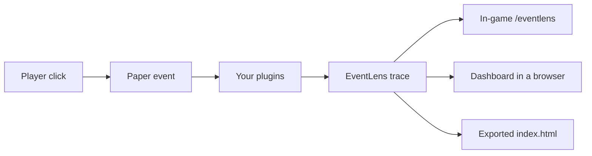

# EventLens

**See which plugins handled a Minecraft event — in what order, who cancelled it, who threw, and who was slow — without changing the event.**

[](CHANGELOG.md)
[](#install)
[](#install)
[](https://github.com/bellaouzo/EventLensMC/actions/workflows/ci.yml)
[](LICENSE)

You only need **one file**: the Paper plugin. Optional client mods and Java agents exist, but EventLens is useful without them.

**[Download](https://github.com/bellaouzo/EventLensMC/releases/tag/v1.11.0)** · [Install](#install) · [First trace](#first-trace) · [Commands](#commands) · [Dashboard](#dashboard) · [FAQ](#faq)

---

## What it is

When a player clicks a block, Paper fires an **event**. Other plugins **listen** to that event. One of them might cancel it, change it, throw an error, or just take a long time.

Chat logs and spark do not show that path. EventLens does:

- Which plugins listened, and in what order
- Who cancelled (or uncancelled) it
- Which supported fields changed
- Which listener looks slow
- Whether the trace was incomplete (limits, sampling, missing agent, or an error)

It **watches**. It does not cancel, reorder, re-fire, or hide exceptions.

**1.11.0** is a stable Paper plugin for **Paper 26.2** (Java **25**). Optional NeoForge / Forge / Fabric client mods are **preview**.



---

## Install

### You need

| | |
|---|---|
| Server | [Paper](https://papermc.io/) **26.2** |
| Java | **25** (`java -version` should say 25) |
| Permission | Commands default to **op** |

### Steps

1. Download **`EventLens-1.11.0.jar`** from [GitHub Releases](https://github.com/bellaouzo/EventLensMC/releases/tag/v1.11.0).
2. Put that file in your server’s `plugins/` folder.
3. **Stop** the server, then start it again. Do **not** use `/reload`.

That is the whole install. Open the game (or the server console) and run `/eventlens status`. You should see version **1.11.0**.

> **Building from source?** After `.\gradlew.bat build` the same jar is at `eventlens-paper/build/libs/EventLens-1.11.0.jar`. Most people should use the [release download](https://github.com/bellaouzo/EventLensMC/releases/tag/v1.11.0) instead.

---

## First trace

Use this when a click, break, or similar action “does the wrong thing” and you want to see which plugin handled it.

```
/eventlens status
/eventlens listeners PlayerInteractEvent --detail verbose
/eventlens trace start PlayerInteractEvent --preset block-flow
```

In-game, reproduce the bug (for example right-click the block). Then:

```
/eventlens trace view <sessionId>
/eventlens trace export <sessionId> --format bundle
/eventlens trace stop
```

- **`status`** — is the plugin loaded? Is timing “precise” or “dispatch-only”? (Both work. Precise needs an optional [Java agent](#java-agents-optional).)
- **`listeners`** — who is registered for that event, even before you trace.
- **`trace start`** — start recording. Tab-complete the event name if you are unsure.
- **`trace view`** — the report in chat.
- **`trace export … bundle`** — writes a folder. Open `index.html` in a browser.
- On the **server computer**, you can also open [http://127.0.0.1:8765](http://127.0.0.1:8765) while the server is running.

`<sessionId>` is the short id printed when the session starts. Click it in chat, or run `/eventlens trace list`.

---

## Optional extras

Skip this until you need it. The plugin works without any of these.

| Extra | When to bother | Where it goes |
|---|---|---|
| **Paper Java agent** `eventlens-agent-1.11.0.jar` | You want *which listener* was slow, not only the whole dispatch | Server JVM args — [setup](#paper-server-agent-optional) |
| **Client mod** (NeoForge, Forge, *or* Fabric) | You want what the *client* fired before the server saw it | Client `mods/` folder — [setup](#client-mods-optional) |
| **Client Java agent** `eventlens-client-agent-1.11.0.jar` | Precise per-mod timing on the client | Launcher JVM args, **not** `mods/` — [setup](#java-agents-optional) |
| **Dashboard** | Graphs and compare in a browser | Already in the Paper plugin, [http://127.0.0.1:8765](http://127.0.0.1:8765) |

Always download matching **1.11.0** files from the same [release](https://github.com/bellaouzo/EventLensMC/releases/tag/v1.11.0).

---

## Words you will see

| Word | Meaning |
|---|---|
| **Event** | Something that happened (`PlayerInteractEvent` = a click) |
| **Listener** | One plugin’s handler for that event |
| **Cancelled** | A plugin said “don’t do this action” |
| **Session** | One recording. Start → reproduce → view → stop |
| **precise** | Optional Java agent loaded; per-listener (or per-mod) times |
| **dispatch-only** | No agent. EventLens still traces; times are coarser |
| **Hot event** | Fires constantly (movement). Needs a filter and `--confirm-hot` |

---

## Commands

Alias: `/el`. All commands default to **op**.

| Command | What it does |
|---|---|
| `/eventlens` or `/eventlens status` | Version, tracing state, agent mode |
| `/eventlens listeners <event>` | Who listens to this event (any Bukkit event) |
| `/eventlens events [text]` | Search the event catalog (`traceable`, `hot`, …) |
| `/eventlens plugin <name>` | One plugin’s listeners, timing, exceptions |
| `/eventlens plugin compare <a> <b>` | Compare two **loaded** plugins |
| `/eventlens exceptions` | Listener exceptions EventLens attributed |
| `/eventlens instrumentation test` | Agent / snapshot self-check |
| `/eventlens trace start …` | Start recording |
| `/eventlens trace view <id>` | Read the recording |
| `/eventlens trace stop` | Stop recording |
| `/eventlens trace export <id> --format bundle` | Shareable `index.html` folder |

<details>
<summary><strong>Full <code>trace</code> command list</strong></summary>

```
/eventlens trace start <Event[,Event…]> [--preset <name>] [--plugin <name>] [--player <name>]
  [--world <name>] [--region x1,z1,x2,z2] [--cancelled any|yes|no]
  [--max-events n] [--max-duration 60s] [--slow-threshold 1ms]
  [--capture-stacks] [--confirm-hot] [--generic] [--detail brief|normal|verbose]

/eventlens trace stop [sessionId]
/eventlens trace restart <sessionId>
/eventlens trace list
/eventlens trace view <sessionId> [page] [--run <n>] [--dispatch <n>] [--plugin <name>]
  [--detail brief|normal|verbose] [--unchanged] [--changed] [--slow] [--conflict]
/eventlens trace live <sessionId> [--channels frequency,slow,cancel,exception,alert]
  [--display chat|actionbar|bossbar] [--filter-plugin <name>]
  [--threshold 1ms] [--burst 50] [--aggregate 3s]
/eventlens trace live status|stop|pause|resume
/eventlens trace export <sessionId> [--format json|ndjson|text|html|bundle] [--shareable|--full]
/eventlens trace copy <sessionId> [--dispatch <n>] [--shareable|--full]
/eventlens trace compare <sessionA> <sessionB> [--plugin <name>]
/eventlens trace correlate <serverSession> <clientSession>
/eventlens trace baseline save|list|compare|delete …
/eventlens trace history
/eventlens trace favorite list|add|remove <event>
/eventlens trace presets
```

Built-in presets: `dev-debug`, `quick-interact`, `plugin-focus`, `block-flow`, `inventory-flow`, `chat-flow`.

Permissions (all default op): `eventlens.command.status`, `.listeners`, `.plugin`, `.instrumentation`, `.trace` (plus children such as `.trace.export.full` for unredacted `--full` exports).

</details>

<details>
<summary><strong>Trace tips</strong></summary>

- **Allowlisted** types get detailed snapshots (142 Paper types — search with `/eventlens events <text>`). Any other **registered** Bukkit event needs `--generic` (common fields only). `listeners` still lists every registered event.
- Several types at once: `/eventlens trace start PlayerInteractEvent,BlockBreakEvent` or `--preset block-flow`.
- Hot events such as `PlayerMoveEvent` need a narrowing filter **and** `--confirm-hot`.
- `stop` with an id stops that session; omit the id to stop all of yours.
- `restart` reuses the same id and keeps earlier runs. View a run with `--run <n>`.
- Exports are **redacted** by default (player names, worlds, coordinates, paths). `--full` needs `eventlens.command.trace.export.full`.
- `bundle` writes a folder: open `index.html`. `json` is the full dump.

</details>

<details>
<summary><strong>Live feed, correlation, allowlist</strong></summary>

**Live feed** (in-game player required) while a session runs:

```
/eventlens trace live <sessionId> --display actionbar
/eventlens trace live --filter-plugin WorldGuard
/eventlens trace live pause
```

**Client–server correlation:** a right-click is two traces (client + server). After you export both:

```
/eventlens trace correlate <serverSession> <clientSession>
```

`trace view` shows **Linked** when a dispatch has a peer. Live pairing uses the `eventlens:correlate` plugin channel when the player has a client mod **and** the server is running EventLens. Paper traces never require the client mod.

**Allowlisted Paper events:** 142 first-class snapshot types (combat, interact, inventory, progress, blocks, entities, weather/raid/chunk, craft/enchant/brew, async pre-login). Add more class names in `config.yml` under `trace.additional-events`, or start a custom event with `--generic`.

</details>

---

## Dashboard

Same viewer, two ways in:

1. **Live** — with the Paper plugin running, open [http://127.0.0.1:8765](http://127.0.0.1:8765) **on the computer that runs the server** (it binds to localhost by default). Pick a live session or a saved report.
2. **Offline** — `/eventlens trace export <id> --format bundle`, then open `index.html`. Works from `file://`.

Views: Overview, Timeline, Flame graph, Event graph, Plugin graph, Compare. Click a dispatch to open detail. Overview pages recent dispatches eight at a time.

If the page does not load: you are probably opening it from another PC. Either browse from the server machine, or change `dashboard.bind-address` (only if you understand the privacy trade-off).

---

## Configuration

`plugins/EventLens/config.yml` is created on first start. You can leave it alone.

| Key | Default | Purpose |
|---|---|---|
| `dashboard.enabled` | `true` | Local HTTP viewer |
| `dashboard.port` | `8765` | |
| `dashboard.bind-address` | `127.0.0.1` | Localhost only unless you change it |
| `output.detail-level` | `normal` | Chat verbosity |
| `trace.slow-threshold-default` | `1ms` | Slow-listener flag |
| `trace.additional-events` | `[]` | Extra event class names |
| `trace.require-hot-event-confirmation` | `true` | Gate `PlayerMoveEvent` and similar |
| `reports.retention-days` | `30` | How long export files stay |

<details>
<summary><strong>More keys, limits, and privacy</strong></summary>

Also: `reports.auto-cleanup`, `trace.live.*`, `trace.presets`, `preferences.max-recent-traces`, `preferences.max-favorites`.

Default limits: 4 concurrent sessions, 4,096 records per session, 256 listener records per dispatch, 32 MiB export file. Design overhead targets (average ≤ 0.25 ms, p95 ≤ 0.75 ms) are EventLens defaults, **not** Paper guarantees. EventLens throttles or stops a session if its own overhead stays too high.

**Privacy:** no external telemetry. Shareable exports redact player names, world names, exact coordinates, and paths unless you pass `--full`. The dashboard binds to localhost by default.

</details>

---

## FAQ

**Do I need a Java agent?** No. Use `/eventlens status`. If it says `dispatch-only`, EventLens still works. The agent only adds finer timing.

**Can I `/reload`?** No. Always `stop`, then start.

**`java -version` says 1.8 or 17.** The plugin needs **Java 25**. Point `JAVA_HOME` at a Java 25 JDK, then restart the server.

**Dashboard is blank / connection refused.** Open [http://127.0.0.1:8765](http://127.0.0.1:8765) on the **server** machine. It does not listen on the public internet unless you change `dashboard.bind-address`.

**Commands say I don’t have permission.** They default to **op**. Give `eventlens.command.status` (and the others you need) if you use a permissions plugin.

**I put the client agent in `mods/` and the launcher complains.** That jar is not a mod. See [Java agents](#java-agents-optional).

**Does this work on Folia / Velocity / Spigot?** Paper **26.2** only. Not Folia, Velocity, or a plain Spigot jar.

**Will EventLens break my plugins?** It must not change observed events. If a trace looks wrong, that is a bug — [open an issue](https://github.com/bellaouzo/EventLensMC/issues).

---

## Java agents (optional)

**You do not need an agent to use EventLens.** Everything above works without one.

An agent only adds **extra timing** (which exact listener or mod handler was slow). If `/eventlens status` already says **precise**, skip this section.

If it says **dispatch-only**, keep using EventLens as-is, or follow the matching steps below.

### What goes where (client)

| File | Put it here | Wrong place |
|---|---|---|
| `eventlens-neoforge-*.jar` (or Forge / Fabric mod) | Your instance **`mods`** folder | — |
| `eventlens-client-agent-*.jar` | A normal folder on disk + tell the **launcher** about it (below) | **`mods/`** (launcher says “not a valid mod file”) |
| `eventlens-observability-*.jar` | **Same folder** as the client agent jar | **`mods/`** |

Download from [GitHub Releases](https://github.com/bellaouzo/EventLensMC/releases). Use the **same version** as your EventLens plugin/mod (`1.11.0`).

### Client agent (NeoForge, Forge, and Fabric) — step by step

This is for **your Minecraft launcher**, not the server. The same client agent jar works on NeoForge, Forge, and Fabric.

**Step 1 — Download**

From the release page, download `eventlens-client-agent-1.11.0.jar`.

`eventlens-observability-*.jar` in the same folder is optional on **1.10.7+** (the agent jar is fat). Older builds still want both jars side by side.

**Step 2 — Put the agent jar in a normal folder**

Example on Windows:

```
C:\Users\You\AppData\Roaming\eventlens-agents\eventlens-client-agent-1.11.0.jar
```

Do **not** put this file in `mods/`.

**Step 3 — Copy the JVM argument line**

Replace the path with **your** real path. Use forward slashes `/` even on Windows:

```
-javaagent:C:/Users/You/AppData/Roaming/eventlens-agents/eventlens-client-agent-1.11.0.jar
```

- One line, no line breaks.
- Starts with `-javaagent:` then the **full path** to the jar.
- If the path has spaces, wrap only the path in quotes:
  `-javaagent:"C:/Users/You/My Agents/eventlens-client-agent-1.11.0.jar"`
- Do **not** use a relative path like `-javaagent:eventlens-client-agent.jar` unless you are sure of the launcher’s working directory.

**Step 4 — Paste into JVM arguments (not game arguments)**

Look for **JVM arguments**, **Java arguments**, **Additional arguments**, or **Custom JVM args** — not “game arguments” and not the mods folder.

<details>
<summary><strong>Prism Launcher / MultiMC</strong> (common for modded)</summary>

1. Select your NeoForge, Forge, or Fabric instance.
2. Click **Edit** (wrench) → **Settings** → **Java**.
3. Enable **Custom Java arguments**.
4. In **JVM arguments**, paste the `-javaagent:...` line. If there is already text, add a **space**, then paste.
5. **OK**, then **Launch**.

</details>

<details>
<summary><strong>CurseForge app</strong></summary>

1. Open your profile → **⋮** → **Profile options**.
2. **Java Settings** / **Advanced** / **Additional Arguments**.
3. Paste into **JVM arguments**.
4. Save and **Play**.

If there is no JVM box, import the instance into [Prism Launcher](https://prismlauncher.org/).

</details>

<details>
<summary><strong>Modrinth App</strong></summary>

1. Instance → **Settings** (gear) → **Java** / **Advanced**.
2. Paste into **Custom JVM arguments**, save, launch.

</details>

<details>
<summary><strong>Other launchers or a <code>.bat</code> file</strong></summary>

Paste the `-javaagent:` line into JVM arguments. In a script, put it **before** `-jar`:

```
java -javaagent:C:/path/to/eventlens-client-agent-1.11.0.jar ... (rest of launch command)
```

The official **Microsoft Minecraft Launcher** does not expose JVM args for modded profiles. Use Prism, CurseForge, or Modrinth.

</details>

**Step 5 — Fully restart the game** (close Minecraft, launch again — not just “Leave world”).

**Step 6 — Check**

```
/eventlens status
```

You want **precise**, not **dispatch-only**. Status also has **[Copy JVM arg]** if you need the line again.

<details>
<summary><strong>Instant crash after adding the JVM arg?</strong></summary>

The game window never opening usually means Java rejected the argument **before** Minecraft starts.

1. **Wrong field** — JVM / Java arguments, not game arguments, not `mods/`.
2. **Bad path** — open the path in File Explorer. Use a full path with forward slashes.
3. **Typo** — `-javaagent:` (colon), not `-javaagent=` or `-java-agent:`.
4. **Wrong jar** — client uses `eventlens-client-agent-*.jar`. `eventlens-agent-*.jar` is for Paper servers.
5. **Smart quotes** — re-type the line if you copied it from a web page.
6. **Launcher log** — look for `Unable to access jarfile` or `agent failed`.

**Workaround:** remove the JVM line. EventLens still works in `dispatch-only` with only the mod in `mods/`.

</details>

### Paper server agent (optional)

For **server** operators who want per-listener timing on Paper.

1. Download `eventlens-agent-1.11.0.jar` from [releases](https://github.com/bellaouzo/EventLensMC/releases/tag/v1.11.0).
2. Put it somewhere stable (for example next to your server jar). **Not** in `plugins/`.
3. Add this to Paper’s **startup JVM arguments** (`start.bat`, Pterodactyl, Docker, …):

```
-javaagent:/full/path/to/eventlens-agent-1.11.0.jar
```

On Windows, `C:/server/eventlens-agent-1.11.0.jar` style paths work.

4. **Restart** (`stop`, then start — not `/reload`).
5. `/eventlens status` → **Agent: attached**, **Mode: precise**.

Dev `runServer` attaches this agent automatically.

<details>
<summary><strong>Why isn’t the agent a plugin?</strong></summary>

A Java agent has to load at **Java startup**, before Paper or Minecraft finish starting. That is why it is a `-javaagent:` line, not a file in `plugins/` or `mods/`.

</details>

---

## Client mods (optional)

**Preview.** You do not need these for server traces.

Install **one** loader jar that matches your client, from the same [1.11.0 release](https://github.com/bellaouzo/EventLensMC/releases/tag/v1.11.0):

| Your client | File to put in `mods/` |
|---|---|
| **NeoForge** 26.2 | `eventlens-neoforge-1.11.0.jar` |
| **Minecraft Forge** 65.1+ | `eventlens-forge-1.11.0.jar` |
| **Fabric** Loader 0.19 + Fabric API 0.157+ | `eventlens-fabric-1.11.0.jar` |

Chat commands, Screen, HUD, and keybinds work on all three. For **precise per-mod timing**, also add the [client Java agent](#client-agent-neoforge-forge-and-fabric--step-by-step) (launcher JVM args — not another file in `mods/`).

| | NeoForge | Forge | Fabric |
|---|:---:|:---:|:---:|
| Minecraft | 26.2 | 26.2 | 26.2 |
| Chat: status, listeners, trace | yes | yes | yes |
| `/eventlens mod` profile | `@SubscribeEvent` scan | `@SubscribeEvent` scan | coarse loaded-mod list |
| Screen + HUD (`/eventlens ui`) | yes | yes | yes |
| Restores last tab / session | yes | yes | yes |
| Client Java agent (`precise`) | yes | yes | yes |

`/eventlens` on the client shows **precise** when the client agent loaded, otherwise **dispatch-only** plus **[Copy JVM arg]** / **[Agent guide]**.

<details>
<summary><strong>Client commands, Screen, and events</strong></summary>

```
/eventlens
/eventlens listeners <ClientEvent>
/eventlens mod <id>
/eventlens mod compare <a> <b>
/eventlens exceptions
/eventlens ui
/eventlens trace start <ClientEvent> [--mod <id>] [--player <name>] [--max-events n] [--confirm-hot]
/eventlens trace stop|pause|resume [sessionId]
/eventlens trace restart <sessionId>
/eventlens trace list
/eventlens trace view <sessionId>
/eventlens trace export <sessionId> [--format json|ndjson|text|html] [--shareable|--full]
```

Open the Screen with `/eventlens ui`, chat **[Open UI]**, or bind `key.eventlens.open` (Controls → EventLens). The world keeps running so traces still capture. Closing restores the last tab and session.

| Tab | What you do |
|---|---|
| **Home** | Platform, tracing, precise vs dispatch-only, HUD toggle |
| **Events** | Search 55 client events, Start (hot events confirm). Double-click starts. |
| **Sessions** | View, Pause / Resume, Restart, Stop, Export. Double-click opens. |
| **Session** | Dispatch list and Fields / Handlers detail |

HUD is off by default (`key.eventlens.hud`). While a session is active it shows the last dispatch, duration, and cancel state.

`/eventlens mod` on NeoForge/Forge uses scanned `@SubscribeEvent` rows. `addListener()` consumers need the client agent. Fabric lists a short set of loaded mod ids, not a full callback inventory.

Not traced: per-frame render events (`RenderGuiEvent`, `RenderLivingEvent`, and similar) and one-shot mod-bus registration events. Fabric still does not hook every NeoForge/Forge game-bus event.

| Event | Hot? | Meaning |
|---|---|---|
| `ClientTickEvent` | yes | Every client tick |
| `ClientWorldTickEvent` | yes | Every client world tick |
| `ClientPlayerTickEvent` | yes | Every local player tick |
| `ClientChatEvent` | | Chat you send |
| `ClientChatReceivedEvent` | | Chat you receive |
| `ClientScreenOpenEvent` / `ClientScreenCloseEvent` | | Screen opened / closed |
| `ClientAttackEvent` | | Attack an entity or air |
| `ClientAttackBlockEvent` | | Punch a block |
| `ClientUseItemEvent` / `ClientUseBlockEvent` / `ClientUseEntityEvent` / `ClientUseEmptyEvent` | | Right-click item, block, entity, or air |
| `ClientPlayerMoveEvent` | yes | Position changed |
| `ClientMovementInputEvent` | yes | Movement keys updated |
| `ClientJoinEvent` / `ClientDisconnectEvent` | | Joined / left a world |
| `ClientRespawnEvent` | | Respawned |
| `ClientGameTypeChangeEvent` | | Game mode changed |
| `ClientPauseEvent` | | Pause state changed |
| `ClientKeyEvent` / `ClientMouseButtonEvent` / `ClientMouseScrollEvent` | | Input |
| `ClientInteractionKeyEvent` | | Attack, use, or pick keybind |
| `ClientTooltipEvent` | yes | Item tooltip gathered |
| `ClientScreenshotEvent` / `ClientToastEvent` / `ClientSoundEvent` | | Screenshot, toast, sound |
| `ClientEntityJoinEvent` / `ClientEntityLeaveEvent` | yes | Entity loaded / unloaded |
| `ClientChunkLoadEvent` / `ClientChunkUnloadEvent` | yes | Chunk loaded / unloaded |
| `ClientRecipesUpdatedEvent` | | Recipe book synced |
| `ClientItemTossEvent` | | You dropped an item |
| `ClientItemPickupEvent` | yes | You picked up an item |
| `ClientDeathEvent` | | A living entity died on the client |
| `ClientHurtEvent` | yes | You took damage |
| `ClientUseEntityAtEvent` | | Right-click a specific point on an entity |
| `ClientUseItemFinishEvent` | | Finished using an item |
| `ClientContainerOpenEvent` / `ClientContainerCloseEvent` | | Container menu opened / closed |
| `ClientBreakSpeedEvent` | yes | Mining speed calculated |
| `ClientHealEvent` | | Your health increased |
| `ClientFoodEvent` / `ClientAirEvent` / `ClientXpEvent` | | Food, air, or XP changed |
| `ClientSelectedSlotEvent` | | Hotbar slot changed |
| `ClientSprintEvent` / `ClientSneakEvent` / `ClientJumpEvent` | | Movement state |
| `ClientGlideEvent` / `ClientSwimEvent` / `ClientSleepEvent` | | Elytra, swim, or sleep |
| `ClientScreenClickEvent` / `ClientScreenKeyEvent` | yes | Click or key inside a screen |

</details>

---

## Compatibility (1.x)

These stay compatible across **1.x**. Breaking them is a **major** version.

| Contract | Current |
|---|---|
| Commands, permissions, `/el` | as documented above |
| Export JSON `reportVersion` | `2` (extra optional fields may appear) |
| Agent protocol | `2` (minimum `1`). Mismatch → `/eventlens status`, not silent wrong timings |
| Paper | **26.2** · Java **25** (no multi-version jar) |
| Client mods | Minecraft **26.2**, **preview** |

Not in this project: Folia, Velocity, packet sniffing, event replay, network telemetry, Hangar / Modrinth / CurseForge publishing.

---

## Development

```powershell
.\gradlew.bat check
.\gradlew.bat runServer
```

Java **25**, Gradle Wrapper **9.6.1**, Paper **26.2**. Stop the test server with `stop`. CI runs `./gradlew check` and Windows `paperSmokeTest` on push/PR.

<details>
<summary><strong>Tasks, layout, and local Java 8 terminals</strong></summary>

```powershell
.\gradlew.bat paperSmokeTest
.\gradlew.bat runServerDebug          # JDWP 127.0.0.1:5005
.\gradlew.bat :eventlens-neoforge:runClient
.\gradlew.bat :eventlens-forge:runClient
.\gradlew.bat :eventlens-fabric:runClient
.\gradlew.bat --stop
```

If `java -version` shows 1.8 in a terminal:

```powershell
$env:JAVA_HOME = [Environment]::GetEnvironmentVariable('JAVA_HOME','User')
$env:Path = "$env:JAVA_HOME\bin;" + $env:Path
.\gradlew.bat --stop
```

| Path | Role |
|---|---|
| `eventlens-core` | Domain and application services (no Bukkit / Minecraft) |
| `eventlens-paper` | Paper plugin, commands, dashboard, bundle export |
| `eventlens-observability` | Shared agent protocol (Java 21 bytecode) |
| `eventlens-agent` | Optional Paper `-javaagent` |
| `eventlens-client-agent` | Optional client `-javaagent` |
| `eventlens-mod-common` | Shared client command / trace logic |
| `eventlens-neoforge` / `forge` / `fabric` | Client mods |
| `eventlens-viewer` | Dashboard TypeScript (bundled into the plugin) |
| `eventlens-testkit` | Fixture plugin for tests |

Base package: `dev.bellaouzo.eventlens`. Main class: `dev.bellaouzo.eventlens.EventLens`.

</details>

---

## License

MIT. See [LICENSE](LICENSE).

- Issues: [github.com/bellaouzo/EventLensMC/issues](https://github.com/bellaouzo/EventLensMC/issues)
- Changes: [CHANGELOG.md](CHANGELOG.md)
- Vulnerabilities: [SECURITY.md](SECURITY.md)
