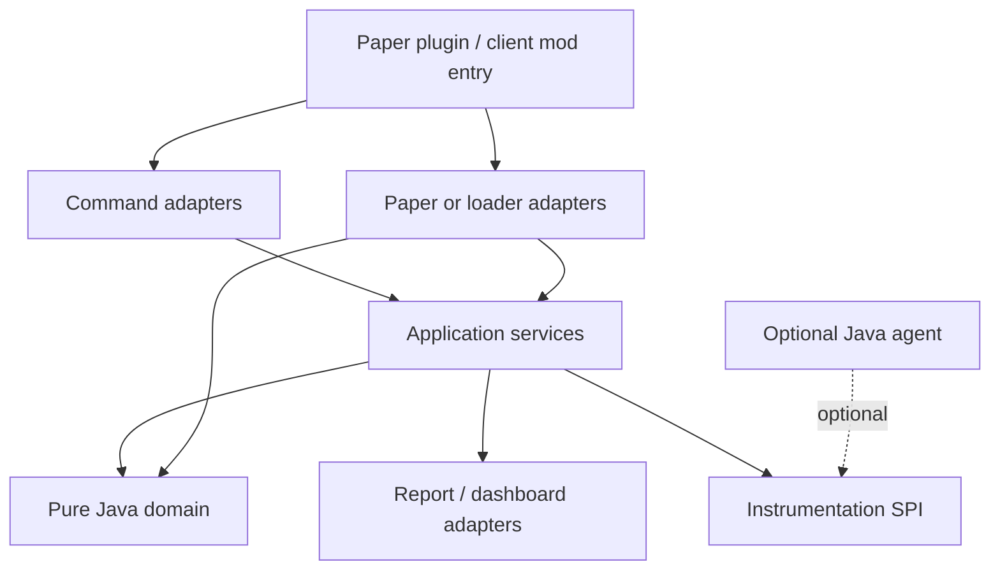

# EventLens

**See how Minecraft events travel through plugins and mods — without changing them.**

EventLens is a diagnostics tool for Paper servers, with optional client mods for NeoForge, Minecraft Forge, and Fabric. It answers the questions that chat logs and spark profilers usually cannot:

- Which plugins or mods listen to this event, and in what order?
- Who cancelled it, changed a field, or threw?
- Which listener is slow?
- What did a single click, break, chat line, or inventory action actually do?

It observes. It does not cancel, reorder, re-fire, or hide exceptions.

| | |
|---|---|
| **Version** | 1.3.0 |
| **Paper plugin** | Paper **26.2** · Java **25** · alias `/el` |
| **Client mods** | Minecraft **1.21.1** · NeoForge · Forge · Fabric |
| **License** | [MIT](LICENSE) |

**[Install](#install)** · **[Use it on a server](#use-it-on-a-paper-server)** · **[Client mods](#client-mods)** · **[Dashboard](#dashboard-and-shareable-viewer)** · **[Developers](#for-developers)**

---

## What you get

| Piece | Who it is for | Required? |
|---|---|---|
| **Paper plugin** `EventLens-1.3.0.jar` | Server operators and plugin authors | Yes, for server traces |
| **Paper Java agent** `eventlens-agent-1.3.0.jar` | Per-listener timing and exception attribution | Optional |
| **Client mods** NeoForge / Forge / Fabric | Client-side traces, Screen, HUD | Optional |
| **Client Java agent** `eventlens-client-agent-1.3.0.jar` | Per-mod handler timing on NeoForge and Forge | Optional; not on Fabric yet |
| **Dashboard** at `http://127.0.0.1:8765` | Live graphs, timeline, compare | Ships with the Paper plugin |
| **Bundle export** | Share a self-contained `index.html` report | Paper command |

The plugin is useful without any agent or client mod. Agents add precise per-listener / per-mod timings. Client mods add the other half of a click (what the client fired before the server saw it).

---

## Install

### Paper plugin

1. Run **Java 25** on the server.
2. Drop `eventlens-paper/build/libs/EventLens-1.3.0.jar` into `plugins/`.
3. Restart the server (`stop`, then start — do not `/reload`).
4. Commands default to **op**.

Built artifact after `.\gradlew.bat build`:

```
eventlens-paper/build/libs/EventLens-1.3.0.jar
```

### Optional Paper Java agent

Without the agent, EventLens still lists listeners and reports **dispatch-level** timing. With it, `/eventlens status` shows `precise` and `trace view` lists each listener’s time, field changes, and exceptions.

Add a JVM argument on the **same** Paper process:

```
-javaagent:eventlens-agent-1.3.0.jar
```

Development `runServer` / `runServerDebug` attach this automatically.

### Optional client mods (Minecraft 1.21.1)

Install **one** loader jar that matches your client:

| Loader | Minecraft | Artifact |
|---|---|---|
| **NeoForge** 21.1.x | 1.21.1 | `eventlens-neoforge/build/libs/eventlens-neoforge-1.3.0.jar` |
| **Minecraft Forge** 52.1.x | 1.21.1 | `eventlens-forge/build/libs/eventlens-forge-1.3.0.jar` |
| **Fabric** Loader 0.16 + Fabric API | 1.21.1 | `eventlens-fabric/build/libs/eventlens-fabric-1.3.0.jar` |

Put the jar in the client `mods/` folder. Chat commands work on all three. Screen, HUD, and keybinds work on all three (Fabric’s Screen is a lighter list UI). Precise per-mod timing needs the **client agent** on NeoForge and Forge only.

#### Optional client Java agent (NeoForge and Forge)

```
-javaagent:eventlens-client-agent-1.3.0.jar
```

Place `eventlens-observability-1.3.0.jar` in the **same folder** as the agent jar. Dev tasks `:eventlens-neoforge:runClient` and `:eventlens-forge:runClient` attach it automatically. Fabric `runClient` does not — Fabric stays `dispatch-only` until a stable invoker exists.

---

## Use it on a Paper server

Typical loop:

```
/eventlens status
/eventlens events Player
/eventlens listeners PlayerInteractEvent --detail verbose
/eventlens trace start PlayerInteractEvent,BlockBreakEvent --preset block-flow
# reproduce the bug
/eventlens trace view <sessionId>
/eventlens trace export <sessionId> --format bundle
/eventlens trace stop
```

Then open the exported folder’s `index.html`, or the live dashboard at [http://127.0.0.1:8765](http://127.0.0.1:8765) on the server machine.

### Commands

Alias: `/el`. All commands default to **op**.

| Command | What it does | Permission |
|---|---|---|
| `/eventlens` or `/eventlens status` | Version, platform, tracing state, agent (`precise` / `dispatch-only` / degraded) | `eventlens.command.status` |
| `/eventlens listeners <event> [page] [--detail brief\|normal\|verbose]` | Registered listeners for **any** Bukkit event | `eventlens.command.listeners` |
| `/eventlens events [prefix]` | Catalog: `traceable` / `generic-only` / `hot` | `eventlens.command.listeners` |
| `/eventlens plugin <plugin> [--detail …]` | Listener counts, timing, exceptions, deps | `eventlens.command.plugin` |
| `/eventlens plugin <plugin> listeners [event] [page]` | That plugin’s handlers | same |
| `/eventlens plugin compare <a> <b>` | Compare two **loaded** plugins | same |
| `/eventlens exceptions [page]` | Inbox of attributed listener exceptions | `eventlens.command.trace` |
| `/eventlens instrumentation test` | Agent / snapshot-bridge self-check | `eventlens.command.instrumentation` |
| `/eventlens trace …` | Sessions, live feed, export, compare | `eventlens.command.trace` (+ children) |

#### Trace sessions

```
/eventlens trace start <Event[,Event…]> [--preset <name>] [--plugin <name>] [--player <name>]
  [--world <name>] [--region x1,z1,x2,z2] [--cancelled any|yes|no]
  [--max-events n] [--max-duration 60s] [--slow-threshold 1ms]
  [--capture-stacks] [--confirm-hot] [--generic] [--detail brief|normal|verbose]

/eventlens trace stop [sessionId]
/eventlens trace restart <sessionId>
/eventlens trace list
/eventlens trace view <sessionId> [page] [--run <n>] [--dispatch <n>] [--plugin <name>]
  [--detail brief|normal|verbose] [--unchanged] [--changed] [--slow] [--conflict]
/eventlens trace live <sessionId> [--channels frequency,slow,cancel,exception,alert]
  [--display chat|actionbar|bossbar] [--filter-plugin <name>]
  [--threshold 1ms] [--burst 50] [--aggregate 3s]
/eventlens trace live status|stop|pause|resume
/eventlens trace export <sessionId> [--format json|ndjson|text|html|bundle] [--shareable|--full]
/eventlens trace copy <sessionId> [--dispatch <n>] [--shareable|--full]
/eventlens trace compare <sessionA> <sessionB> [--plugin <name>]
/eventlens trace correlate <serverSession> <clientSession>
/eventlens trace baseline save|list|compare|delete …
/eventlens trace history
/eventlens trace favorite list|add|remove <event>
/eventlens trace presets
```

Notes:

- **Allowlisted** types get first-class snapshots (see [Supported Paper events](#supported-paper-events)). Any other **registered** Bukkit event needs `--generic` (common fields only). `listeners` still resolves every registered event.
- Several types in one session: `/eventlens trace start Interact,Break` or `--preset block-flow`.
- Hot events such as `PlayerMoveEvent` need a narrowing filter and `--confirm-hot` (`eventlens.command.trace.hot-event`).
- `stop` with an id stops that session; omit the id to stop all of yours.
- `restart` reuses the same id, keeps earlier runs, and marks the session `RESTARTED`. View a run with `--run <n>`.
- Exports are **redacted** by default. `--full` needs `eventlens.command.trace.export.full`.
- `bundle` writes a folder: open `index.html`. `json` is the full snapshot dump.

Built-in presets: `dev-debug`, `quick-interact`, `plugin-focus`, `block-flow`, `inventory-flow`, `chat-flow`.

#### Live feed

Attach while a session is running (in-game player required):

```
/eventlens trace live <sessionId> --display actionbar
/eventlens trace live --filter-plugin WorldGuard
/eventlens trace live pause
```

Channels: aggregated frequency, slow listeners, cancellation, exceptions, plugin bursts. Filters and pause/resume do not restart the trace.

#### Client–server correlation

A right-click is two traces today. After you export both sides:

```
/eventlens trace correlate <serverSession> <clientSession>
```

`trace view` then shows **Linked** when a dispatch has a peer. Live pairing uses the optional `eventlens:correlate` plugin channel when the player has a client mod **and** the server is running EventLens. Offline join still works from the two reports. Paper traces never require the client mod.

### Supported Paper events

First-class snapshots (22 types):

`BlockBreakEvent`, `BlockPlaceEvent`, `PlayerInteractEvent`, `PlayerMoveEvent`, `PlayerTeleportEvent`, `PlayerCommandPreprocessEvent`, `InventoryClickEvent`, `InventoryOpenEvent`, `InventoryCloseEvent`, `InventoryDragEvent`, `EntityDamageEvent`, `EntityDeathEvent`, `EntitySpawnEvent`, `CreatureSpawnEvent`, `PlayerJoinEvent`, `PlayerQuitEvent`, `PlayerDropItemEvent`, `EntityPickupItemEvent`, `ProjectileLaunchEvent`, `ProjectileHitEvent`, `ServerCommandEvent`, `AsyncChatEvent`

Add more names in `config.yml` under `trace.additional-events`, or start a registered custom event with `--generic`.

---

## Client mods

Same `/eventlens` family in client chat, plus an in-game Screen.

| | NeoForge | Forge | Fabric |
|---|:---:|:---:|:---:|
| Minecraft | 1.21.1 | 1.21.1 | 1.21.1 |
| Chat: status, listeners, trace | yes | yes | yes |
| `/eventlens mod` profile + compare | yes | yes | yes |
| `/eventlens exceptions` | yes | yes | yes |
| `trace pause` / `resume` / `restart` | yes | yes | yes |
| Start filters `--mod` / `--player` | yes | yes | yes |
| Screen + HUD + keybinds (`/eventlens ui`) | full panel | full panel | simpler Screen |
| Restores last tab / session | yes | yes | no |
| `@SubscribeEvent` inventory + overlap | yes | yes | coarse loaded-mod list |
| Client Java agent (`precise`) | yes | yes | **not yet** |

`/eventlens` on the client shows `Instrumentation  precise` when the client agent loaded, otherwise `dispatch-only`. Chat stays a fallback if you never open the Screen.

`/eventlens trace live` on a client does not start a Paper-style channelled feed. It tells you that the HUD and command toasts are the local equivalent.

### Client commands

```
/eventlens
/eventlens listeners <ClientEvent>
/eventlens mod <id>
/eventlens mod compare <a> <b>
/eventlens exceptions
/eventlens ui
/eventlens trace start <ClientEvent> [--mod <id>] [--player <name>] [--max-events n] [--confirm-hot]
/eventlens trace stop [sessionId]
/eventlens trace pause [sessionId]
/eventlens trace resume [sessionId]
/eventlens trace restart <sessionId>
/eventlens trace list
/eventlens trace view <sessionId>
/eventlens trace export <sessionId>
```

Clickable chat: session ids, **[Open UI]**, **Saved to** / **Folder** (click copies the path; a short `Copied` toast confirms). Start, stop, pause, resume, restart, and export also raise toasts. The export toast is `Exported N dispatch(es)` only — the path stays in chat.

`/eventlens mod` on NeoForge and Forge uses scanned `@SubscribeEvent` rows. `addListener()` consumers stay invisible without the client agent. Fabric lists EventLens plus a short set of other loaded mod ids — not a full callback inventory.

### In-game Screen and HUD

**NeoForge and Forge** share the full diagnostic panel:

- **Open:** `/eventlens ui`, `/el ui`, status-chat **[Open UI]**, or bind `key.eventlens.open` (Controls → EventLens). Unbound by default.
- The world keeps running (`isPauseScreen` is false) so traces still capture.
- Closing stores tab, session, run, and dispatch in `config/eventlens/ui.properties` and restores them next time.

| Tab | What you do |
|---|---|
| **Home** | Platform, tracing, precise vs dispatch-only, HUD toggle, jump to Events / Sessions |
| **Events** | Search 33 client events, subscriber / overlap counts, Start (hot events confirm). Double-click starts. |
| **Sessions** | Search, View, Pause / Resume, Restart (stopped), Stop, Export. Double-click opens. |
| **Session** | Dispatch list (sequence, time, player, field preview, cancel, handlers) and Fields / Handlers detail |

Hover the **live** / **paused** / **idle** and **precise** / **dispatch** pills for agent protocol, version, and session counts.

**HUD** is off by default. Toggle on Home or `key.eventlens.hud`. While a session is active it shows event name, last dispatch, duration, and handler count or slowest mod. Hidden while the Screen is open.

**Fabric** has `/eventlens ui`, HUD, and the same keybinds, with a lighter Screen (Home / Events / Sessions lists). It does not persist last tab or show the NeoForge Session detail panel. Chat commands are the complete Fabric workflow.

Flame graphs stay in the [dashboard](#dashboard-and-shareable-viewer) after you export.

### Supported client events (33)

Not traced: per-frame render events (`RenderGuiEvent`, `RenderLivingEvent`, and similar) and one-shot mod-bus registration events.

| Event | Hot? | Meaning |
|---|---|---|
| `ClientTickEvent` | yes | Every client tick |
| `ClientWorldTickEvent` | yes | Every client world tick |
| `ClientPlayerTickEvent` | yes | Every local player tick |
| `ClientChatEvent` | | Chat you send |
| `ClientChatReceivedEvent` | | Chat you receive |
| `ClientScreenOpenEvent` / `ClientScreenCloseEvent` | | Screen opened / closed |
| `ClientAttackEvent` | | Attack an entity or air |
| `ClientAttackBlockEvent` | | Punch a block |
| `ClientUseItemEvent` / `ClientUseBlockEvent` / `ClientUseEntityEvent` / `ClientUseEmptyEvent` | | Right-click item, block, entity, or air |
| `ClientPlayerMoveEvent` | yes | Position changed |
| `ClientMovementInputEvent` | yes | Movement keys updated |
| `ClientJoinEvent` / `ClientDisconnectEvent` | | Joined / left a world |
| `ClientRespawnEvent` | | Respawned |
| `ClientGameTypeChangeEvent` | | Game mode changed |
| `ClientPauseEvent` | | Pause state changed |
| `ClientKeyEvent` / `ClientMouseButtonEvent` / `ClientMouseScrollEvent` | | Input |
| `ClientInteractionKeyEvent` | | Attack, use, or pick keybind |
| `ClientTooltipEvent` | yes | Item tooltip gathered |
| `ClientScreenshotEvent` / `ClientToastEvent` / `ClientSoundEvent` | | Screenshot, toast, sound |
| `ClientEntityJoinEvent` / `ClientEntityLeaveEvent` | yes | Entity loaded / unloaded |
| `ClientChunkLoadEvent` / `ClientChunkUnloadEvent` | yes | Chunk loaded / unloaded |
| `ClientRecipesUpdatedEvent` | | Recipe book synced |

---

## Dashboard and shareable viewer

Two ways to open the same viewer:

1. **Live** — with the Paper plugin running, browse [http://127.0.0.1:8765](http://127.0.0.1:8765) on the server (bind is loopback by default). Pick a live session or a saved report. The page updates while the session runs.
2. **Offline bundle** — `/eventlens trace export <id> --format bundle`, then open `index.html` in that folder. Works from `file://`.

Views: **Overview**, **Timeline**, **Flame graph**, **Event graph**, **Plugin graph**, **Compare**. Live mode lists sessions and saved reports in the left sidebar; Offline loads a JSON file. The context panel shows session, world, TPS, agent, and redaction facts.

Compare two JSON reports (including a Paper session vs a client export). When both have correlation keys, paired dispatches are counted.

The event graph needs the live `/api` when you are on the dashboard; a bare bundle degrades that view.

---

## Configuration

`plugins/EventLens/config.yml` (defaults merge on startup):

| Key | Default | Purpose |
|---|---|---|
| `reports.retention-days` | `30` | How long export files stay |
| `reports.auto-cleanup` | `true` | Delete old reports |
| `dashboard.enabled` | `true` | Local HTTP viewer |
| `dashboard.port` | `8765` | |
| `dashboard.bind-address` | `127.0.0.1` | Loopback only unless you change it |
| `output.detail-level` | `normal` | Default chat verbosity |
| `trace.slow-threshold-default` | `1ms` | Slow-listener flag |
| `trace.additional-events` | `[]` | Extra allowlisted class names |
| `trace.require-hot-event-confirmation` | `true` | Gate `PlayerMoveEvent` and friends |
| `trace.live.*` | | Aggregation, burst, display mode |
| `trace.presets` | | Named start option packs |
| `preferences.max-recent-traces` | `20` | |
| `preferences.max-favorites` | `32` | |

NeoForge / Forge UI prefs: `config/eventlens/ui.properties` (last tab, session, HUD).

### Resource limits

| Limit | Default |
|---:|---:|
| Concurrent sessions | 4 |
| Records per session | 4,096 |
| Listener records per dispatch | 256 |
| Snapshot fields / depth | 64 / 2 |
| Collection or map entries | 32 |
| Captured string | 512 chars |
| Serialized record | 16 KiB |
| Export file | 32 MiB |
| Pending exports | 2 |

Design targets per observed dispatch: average ≤ 0.25 ms, p95 ≤ 0.75 ms. EventLens throttles if p95 stays above 1 ms, stops the session if p95 stays above 2.5 ms for three windows, and emergency-stops after any single EventLens operation over 10 ms.

These are EventLens defaults, not Paper guarantees.

### Privacy

No external telemetry. Shareable exports redact player names, world names, exact coordinates, and paths unless an operator passes `--full`. The dashboard binds to localhost by default.

EventLens must not change observed events, reorder listeners, invoke listeners twice, hide exceptions, or retain live Bukkit / Minecraft objects off the main thread.

---

## For developers

### Requirements

- **Java 25** JDK (`JAVA_HOME` must point here — Cursor terminals sometimes inherit Java 8)
- Gradle Wrapper **9.6.1** (`gradlew.bat`; no global Gradle install)
- Windows-first workflow; any shell that can run the wrapper works
- Paper **26.2** via run-paper **3.0.2** (`26.2.build.92-stable`)

```powershell
.\gradlew.bat clean build
.\gradlew.bat check
.\gradlew.bat runServer
```

On first `runServer`, accept the Minecraft EULA in `run/eula.txt`. Dev server directory: `run/` (gitignored). Stop with `stop` in the console — never `/reload`.

If `java -version` shows 1.8:

```powershell
$env:JAVA_HOME = [Environment]::GetEnvironmentVariable('JAVA_HOME','User')
$env:Path = "$env:JAVA_HOME\bin;" + $env:Path
.\gradlew.bat --stop
```

### Gradle tasks

```powershell
.\gradlew.bat check              # tests, Spotless, SonarLint, ArchUnit, file-length
.\gradlew.bat paperSmokeTest     # headless Paper startup + command smoke
.\gradlew.bat runServer          # Paper 26.2 + plugin + Paper agent
.\gradlew.bat runServerDebug     # JDWP on 127.0.0.1:5005 (no suspend)
.\gradlew.bat :eventlens-neoforge:runClient
.\gradlew.bat :eventlens-forge:runClient
.\gradlew.bat :eventlens-fabric:runClient
.\gradlew.bat --stop
```

Helpers: `.\scripts\smoke-test.ps1` (build, checklist, `runServer`) and `.\scripts\smoke-test-full.ps1`.

Cursor tasks: Clean Build, Build, Test, Run Paper Server, Run Paper Server (Debug), Stop Gradle Daemons. Attach debugger with **Java: Attach to EventLens Paper Server**.

### Layout

| Path | Role |
|---|---|
| `eventlens-core` | Pure Java domain and application services (no Bukkit / Minecraft) |
| `eventlens-paper` | Paper 26.2 plugin, commands, dashboard HTTP, bundle export |
| `eventlens-observability` | Shared agent protocol (Java 21 bytecode) |
| `eventlens-agent` | Optional Paper `-javaagent` (`RegisteredListener.callEvent`) |
| `eventlens-client-agent` | Optional NeoForge / Forge `-javaagent` (game-bus `invoke`) |
| `eventlens-mod-common` | Shared client command / trace logic (no loader Screen types) |
| `eventlens-neoforge` | NeoForge 1.21.1 client mod |
| `eventlens-forge` | Minecraft Forge 1.21.1 client mod |
| `eventlens-fabric` | Fabric 1.21.1 client mod (Screen lives here, not in mod-common) |
| `eventlens-viewer` | Dashboard TypeScript (built into the plugin `dashboard/` resources) |
| `eventlens-testkit` | Fixture plugin for tests |
| `docs/`, `AGENTS.md` | Local handbook (gitignored — not on the remote) |

Base package: `dev.bellaouzo.eventlens`. Paper main class: `dev.bellaouzo.eventlens.EventLens`.



Domain code must not import Paper, Fabric, Forge, file APIs, or JSON libraries.

### Tests and CI

JUnit 5, ArchUnit, MockBukkit (`mockbukkit-v26.1.2`), forked-JVM agent load tests, Spotless, JaCoCo. CI (`.github/workflows/ci.yml`) runs `./gradlew check` and Windows `paperSmokeTest` on push/PR to `main` or `master`.

### What is not in this repo yet

- Fabric client Java agent (deferred until a stable invoker is verified)
- Folia, Velocity, packet sniffing, Paper chest GUIs, event replay, network telemetry

Changelog: [CHANGELOG.md](CHANGELOG.md).

---

## License

MIT. See [LICENSE](LICENSE).
