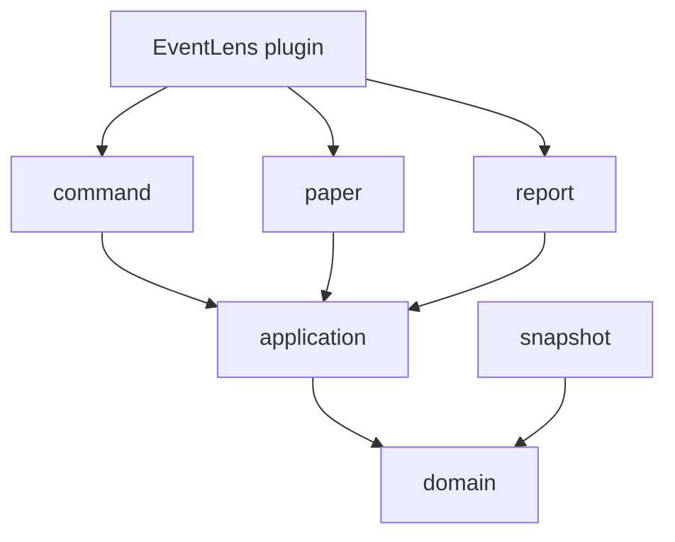
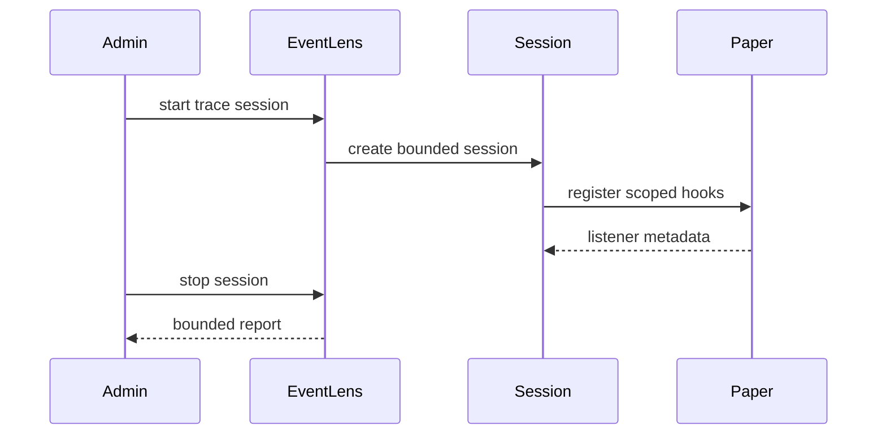

# EventLens Architecture

EventLens uses **ports and adapters** with a pure Java domain at the center. Paper-specific code stays at the edges; tracing policies and session rules stay testable without a running server.

## Current physical layout

Single Gradle project (`EventLens`). No subprojects yet.

```
dev.bellaouzo.eventlens
├── EventLens.java              Composition root (JavaPlugin)
├── application/                Use-case orchestration
│   └── StatusQueryService.java
├── command/                    Command adapters
│   └── StatusCommand.java
├── domain/                     Pure Java records and policies
│   └── status/
│       └── EventLensStatus.java
└── trace/                      Session lifecycle (stub)
    └── TraceSessionManager.java
```

Planned packages (create when code exists): `paper`, `snapshot`, `diff`, `filter`, `report`, `observability`, `instrumentation`.

## Dependency rule



Domain code must not import Bukkit, Paper, or infrastructure.

## Future module split (not yet justified)

Possible later subprojects:

- `eventlens-core` — pure Java domain
- `eventlens-paper` — plugin and Paper adapters
- `eventlens-agent` — optional `-javaagent` artifact
- `eventlens-testkit` — fixture plugin for integration tests

Split only when boundaries are stable and a separate artifact is required.

## Trace flow (planned)



## Current state

See `AGENTS.md` for verified implementation status.
