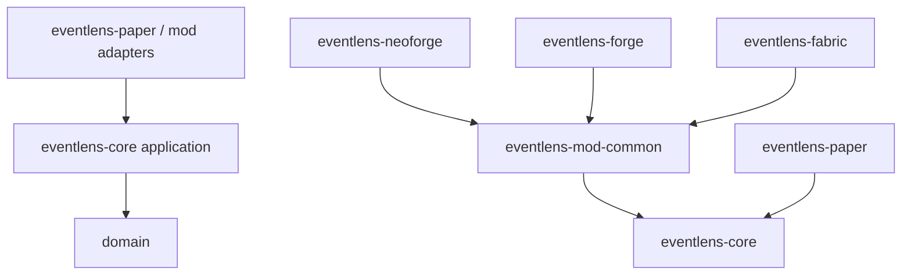

# EventLens Architecture

EventLens uses **ports and adapters** with a pure Java core. Paper-specific and loader-specific code stay at the edges.

## Physical layout (Gradle subprojects)

```
EventLens/
├── eventlens-core/           domain, application, trace (Java 21 bytecode)
├── eventlens-paper/          Paper plugin + commands + paper adapters
├── eventlens-mod-common/     Shared client trace orchestration
├── eventlens-neoforge/       NeoForge 1.21.1 client mod
├── eventlens-forge/          Minecraft Forge 1.21.1 client mod
├── eventlens-fabric/         Fabric client mod
├── eventlens-agent/          Optional Paper Java agent
├── eventlens-client-agent/   Optional NeoForge client Java agent
├── eventlens-observability/  Agent↔plugin protocol (Java 21 bytecode)
├── eventlens-testkit/        Fixture plugin for dev/smoke tests
└── eventlens-viewer/         Vite dashboard + offline report viewer
```

## Dependency rule



- `eventlens-core` must not import Bukkit, NeoForge, Forge, or Fabric APIs.
- Server agent artifacts stay out of client mod JARs.
- In-game Screen/HUD classes stay in loader subprojects. See `docs/CLIENT_UI.md`.

## Trace flow

Paper and client mods reuse the same domain session/report pipeline. Exports include `environment.runtimeKind` (`paper`, `neoforge`, `forge`, `fabric`) for the shared viewer.

## Current state

See `AGENTS.md` for verified implementation status.
