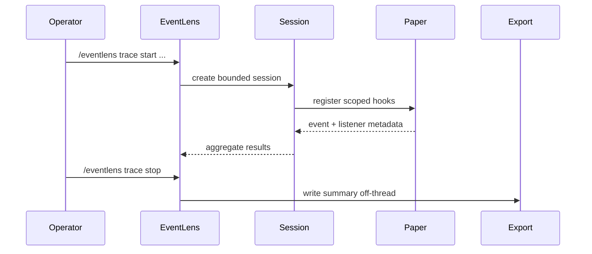

# EventLens Architecture

EventLens is organized around listener tracing concerns that should stay isolated from one another.

## Package layout

```
dev.bellaouzo.eventlens
├── EventLens.java                 Main plugin lifecycle
├── command/                       Player and console commands
├── trace/                         Trace session lifecycle and counters
├── discovery/                     Listener registration discovery (planned)
├── snapshot/                      Event property snapshots (planned)
├── compare/                       Before/after snapshot comparison (planned)
├── timing/                        Listener execution timing (planned)
├── filter/                        Event and scope filters (planned)
├── format/                        Human-readable output (planned)
├── export/                        Trace export writers (planned)
└── paper/                         Paper-specific adapters (planned)
```

## Design principles

### Explicit trace sessions

Tracing must not run globally by default. Operators start a trace session with filters that bound scope, duration, and buffer size.

### No unsafe retention

Do not store `Event`, `Player`, or other Bukkit objects longer than needed for a single trace step. Prefer primitive identifiers and immutable snapshots of supported properties.

### Main-thread safety

Analysis, export, and expensive formatting run off the main server thread. Registration discovery and lightweight counters may use synchronous hooks, but heavy work is queued.

### Paper-first integration

Use supported Paper and Adventure APIs. Reflective or NMS-based adapters belong behind interfaces and are added only when the public API is insufficient.

### Observation without mutation

EventLens must observe listener behavior without changing event outcomes for other plugins unless an explicit diagnostic mode is documented and opt-in.

## Current state

Implemented:

- Plugin bootstrap and shutdown cleanup
- `TraceSessionManager` with disabled-by-default tracing state
- `/eventlens status` command

Not yet implemented:

- Listener discovery
- Event snapshots and comparison
- Timing and slow-listener warnings
- Filters beyond session setup
- Export formats

## Planned trace flow


